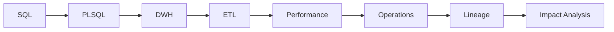

# Oracle Data Developer Handbook

This site is the English web edition of the C01–C40 Oracle Data Developer course. It covers Oracle SQL and PL/SQL, OLTP/OLAP, Data Warehouse, ETL/ODI, optimizer and performance, architecture, Data Operations, banking data concepts, lineage and impact analysis.

## How to use it

Read each chapter, run the SQL in a lab PDB such as `FREEPDB1`, and inspect actual execution behavior. The goal is not syntax memorization; it is an operational mental model that connects business rules, data design, execution, diagnostics and controlled change.

> **Coverage note:** this build consolidates recoverable project-chat content and the prior Oracle 26ai curriculum. Where the complete original chat transcript was not exposed to this run, the chapter is reconstructed and expanded rather than represented as a byte-for-byte transcript.
