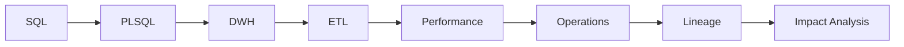

# Oracle Database Developer Guide

This site is a structured learning and reference guide for Oracle database and data development. It covers Oracle SQL and PL/SQL, transactions, OLTP/OLAP, Data Warehouse concepts, ETL/ODI, optimizer and performance, architecture, Data Operations, banking data concepts, lineage and impact analysis.

The focus is a progressive path from SQL fundamentals to practical Oracle data engineering, connecting database concepts with the way they are used in real data flows.

## Who this is for

The guide is intended for SQL and PL/SQL developers, data developers, technical analysts and engineers who want to strengthen their Oracle foundations and connect them with DWH, ETL and operational data concepts.

## Recommended learning path

Follow the chapters in sequence when learning the material for the first time:

**SQL → PL/SQL → Transactions → OLTP/OLAP → Data Warehouse → ETL → Performance → Oracle Architecture → Data Engineering → Lineage and Impact Analysis**

## How to use it

Read each chapter, run the SQL in a lab PDB such as `FREEPDB1`, and inspect actual execution behavior. The goal is not syntax memorization; it is an operational mental model that connects business rules, data design, execution, diagnostics and controlled change.

> **Coverage note:** this build consolidates recoverable project-chat content and the prior Oracle 26ai curriculum. Where the complete original chat transcript was not exposed to this run, the chapter is reconstructed and expanded rather than represented as a byte-for-byte transcript.
